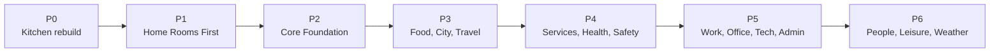

# Content Coverage Map

Этот документ является визуальной картой покрытия тем LunaCards.

Статус: derived status map v0. Source of truth для очередности колод остается [Deck Master Plan](deck-master-plan.md), source of truth для taxonomy остается [Card Taxonomy](card-taxonomy.md). [Content Roadmap](product-content-roadmap.md) объясняет принципы, но не заменяет operational order. Внешние benchmark-наблюдения фиксируются в [External Content Benchmark](external-content-benchmark.md). Если карта расходится с этими документами, нужно остановиться и привести документацию к одному состоянию.

## Legend

| Status | Meaning |
| --- | --- |
| Done / final | Есть созданная колода с полным 54-language покрытием, source-backed transcription evidence, enforced all-language native-copy entry-source-backed translation gate, final export, Drive delivery status and completed post-final linguistic audit. After the 2026-05-02 reset, this status applies only when delivery freshness currently passes. |
| Historical output | Google Sheet/output was delivered before the 2026-05-02 reset, but local Postgres content was cleared. Historical output is not active generated coverage until deliberately rebuilt from the clean DB. |
| Last delivered / refresh blocked | Есть последняя доставленная Google Sheet, но текущие более строгие Postgres/export/audit gates уже требуют repair before a refreshed final delivery can be claimed. |
| Delivery-stale | Ранее выгруженная final-колода есть, но после изменения QA/policy текущие Postgres/export/audit gates требуют repair before current final status. |
| Pilot / partial | Есть рабочий pilot или частично созданные данные. Это не означает final-ready покрытие 54 языков. |
| Spec ready | Deck spec exists and scope is fixed, but generation is still blocked until explicit `approved_for_generation`. |
| Approved for generation | Deck spec exists, user approved generation, and `check-deck-ready` passes. |
| Next by Sort | Следующие колоды зафиксированы integer `Sort` order in Deck Master Plan, but still need deck spec before generation. |
| Planned backlog | Колоды есть в backlog v1, но еще не сгенерированы. |
| Taxonomy only | Тема есть в taxonomy, но deck-level plan еще слабый или неполный. |
| Gap | Домен назван, но требует декомпозиции перед генерацией. |

## High-Level Visual Map

```mermaid
flowchart TD
  root["LunaCards content coverage"]

  root --> current["Current post-reset delivery"]
  current --> k0_current["Kitchenware Basics<br/>Home / Kitchen<br/>A1 / Basic<br/>active in local DB"]
  current --> k1_current["Cooking Actions<br/>Home / Kitchen<br/>A1-A2 / Elementary<br/>active in local DB"]
  current --> k2_current["Kitchen Storage & Cleaning<br/>Home / Kitchen<br/>A2 / Elementary<br/>active in local DB"]
  current --> k3_current["Kitchen Small Tools & Supplies<br/>Home / Kitchen<br/>A2 / Elementary<br/>active in local DB"]
  current --> bath_current["Bathroom Essentials<br/>Home / Bathroom<br/>A1 / Basic<br/>active in local DB"]
  current --> bedroom_current["Bedroom Basics<br/>Home / Bedroom<br/>A1 / Basic<br/>active in local DB"]
  current --> living_current["Living Room Basics<br/>Home / Living Room<br/>A1 / Basic<br/>active in local DB"]
  current --> dining_current["Dining Room & Table Setup<br/>Home / Dining Room<br/>A1-A2 / Basic-Elementary<br/>active in local DB"]
  current --> entry_current["Entryway & Outerwear<br/>Home / Entryway<br/>A1 / Basic<br/>active in local DB"]
  current --> furniture_current["Furniture Basics<br/>Home / Furniture<br/>A1 / Basic<br/>active in local DB"]
  current --> laundry_current["Laundry & Cleaning Basics<br/>Home / Laundry<br/>A1-A2 / Basic-Elementary<br/>active in local DB"]
  current --> numbers_current["Numbers & Counting<br/>Core Foundation<br/>A1 / Basic<br/>active in local DB"]
  current --> colors_current["Colors & Shapes<br/>Core Foundation<br/>A1 / Basic<br/>active in local DB"]
  current --> pronouns_current["Pronouns & People Basics<br/>Core Foundation<br/>A1 / Basic<br/>active in local DB"]
  current --> question_words_current["Question Words<br/>Core Foundation<br/>A1 / Basic<br/>active in local DB"]
  current --> basic_verbs_current["Basic Verbs<br/>Core Foundation<br/>A1-A2 / Elementary<br/>active in local DB"]

  root --> historical["Historical outputs before reset"]

  root --> planned["Planned backlog v1"]
  planned --> core["Core Foundation"]
  planned --> personal["Personal Life & Daily Routine"]
  planned --> home["Home & Everyday Spaces"]
  planned --> food["Food & Eating"]
  planned --> city["City & Transport"]
  planned --> travel["Travel & Accommodation"]
  planned --> services["Shopping, Money, Health, Safety, Documents"]
  planned --> work["Work, School, Office, Tech"]
  planned --> people["People, Leisure, Nature, Time"]

  root --> weak["Needs more decomposition"]
  weak --> targets["Deck target ranges and candidate pools"]
  weak --> localized["Country-specific/local service variants"]
  weak --> advanced["Advanced/specialized expansions"]
  weak --> contract["Final spreadsheet contract and QA return flow"]
```

## Coverage By Domain

| Domain | Current coverage | Status | Notes |
| --- | --- | --- | --- |
| Home / Kitchen | `Kitchenware Basics`; `Cooking Actions`; `Kitchen Storage & Cleaning`; `Kitchen Small Tools & Supplies` | Sort 1-4 are generated and delivery-fresh | All four current kitchen decks pass Google Sheet readback and delivery freshness. `Kitchen Small Tools & Supplies` was retrofitted on 2026-05-13 to 32 cards with 8 explicit Kitchenware meaning-reuse rows. Their current Google Sheet titles are normalized with Deck Master Plan numbers: `FlashcardsLuna 001 of 180 - Kitchenware Basics` through `FlashcardsLuna 004 of 180 - Kitchen Small Tools & Supplies`. |
| Core Foundation | `Numbers & Counting`; `Colors & Shapes`; `Pronouns & People Basics`; `Question Words`; `Basic Verbs`; `Practical Action Verbs`; object states/qualities, time, polite words | Sort 16-21 generated/delivery-fresh + planned backlog | Needed early because it supports all other decks; verbs and qualities prevent noun-only coverage. `Numbers & Counting` was rebuilt from the clean DB on 2026-05-17 with 44 cards x 54 languages and new Google Sheet `1BWfmAdcRXOHfV8XLyUOuV5Z0GOwlnJLviFRg-GdPkJY`. `Colors & Shapes` was rebuilt on 2026-05-18 with 34 cards x 54 languages and new Google Sheet `14jMyxsNdT2wXr0vQB9hi4SV0qpDdrq_qJb7Rc_4kDmc`. `Pronouns & People Basics` was rebuilt on 2026-05-19 with 34 cards x 54 languages and new Google Sheet `1D1tbd0fFDgwjbS9BbsKT86PD33EPd9jm5lUViyLpuKw`. `Question Words` was rebuilt on 2026-05-19 with 18 cards x 54 languages and new Google Sheet `1A46O8Gv5FJdePgZkaHP5PecJlGwBrzk_GH_r1-S9fNI`. `Basic Verbs` was rebuilt on 2026-05-19 with 36 cards x 54 languages and new Google Sheet `1dX5EG6beSKj3dP4fAjXcX9zWykl-Xhd3pchxWzMp_WI`. `Practical Action Verbs` was rebuilt on 2026-05-20 with 36 cards x 54 languages and new Google Sheet `1ltPINZkvavEp0nz3Fhxu0lT0LPkJk5QFE6WzxmphPPw`. |
| Personal Life | Daily routine, sleep/morning routine, physical states, personal organization | Planned backlog | New explicit daily-life track to avoid losing high-frequency routine words. |
| Learner Toolkit | Learning help words, pronunciation/script support, classroom/app vocabulary | Gap | External benchmark shows this should be explicit, but current production still uses vocabulary-only decks, not ready phrase cards. |
| Home & Everyday Spaces | `Bathroom Essentials`; `Bedroom Basics`; `Living Room Basics`; `Dining Room & Table Setup`; `Entryway & Outerwear`; `Furniture Basics`; `Laundry & Cleaning Basics`; utilities/problems, pest control, kids/baby care, pets, home office, exterior, apartment building, outdoor home, park remain backlog | `Bathroom Essentials`, `Bedroom Basics`, `Living Room Basics`, `Dining Room & Table Setup`, `Entryway & Outerwear`, `Furniture Basics` and `Laundry & Cleaning Basics` rebuilt and delivery-fresh | `Bathroom Essentials` was rebuilt from the clean DB on 2026-05-06 with 35 cards x 54 languages, passed runner QA/export/delivery/readback/post-final audit 1890/1890 and freshness, and created new Google Sheet `1dUGgoVP2MLgPpRK03mSzh6DHaPWb0S6ryKr38OBMI5o` in the required Drive folder. `Bedroom Basics` was rebuilt from the clean DB on 2026-05-06 with 30 cards x 54 languages, passed runner QA/export/delivery/readback/post-final audit 1620/1620 and freshness, and created new Google Sheet `1LV2yQGx_pAUgjEG2NNS1aPKvXBW-7TmL8Y-z4aBmUMg` in the required Drive folder. `Living Room Basics` was rebuilt from the clean DB on 2026-05-08 with 30 cards x 54 languages, passed runner QA/export/delivery/readback/post-final audit 1620/1620 and freshness, and created new Google Sheet `146LfF_3P6Gf2f66pb3ddIhiptuxDr7H7umzSVjDNTtQ` in the required Drive folder. `Dining Room & Table Setup` was rebuilt from the clean DB on 2026-05-08 and retrofitted on 2026-05-13 to 40 cards x 54 languages by explicit Kitchenware meaning reuse; it passed DB QA/export/same-file Google Sheet update/readback/post-final audit 2160/2160 and freshness in Sheet `1WpphriRtOBeZo2WOU8bv1gCTx88IxMYGpSSPeVbjRX0`. `Entryway & Outerwear` was rebuilt from the clean DB on 2026-05-12 with 35 cards x 54 languages, passed runner QA/export/delivery/readback/post-final audit 1890/1890 and freshness, and created new Google Sheet `12kQQ3qH_CdbbC0fac4Ap4j1lUyVw3VPxwoxaxJCZSb0` in the required Drive folder. `Furniture Basics` and `Laundry & Cleaning Basics` were rebuilt on 2026-05-13 and pass final Google Sheet delivery freshness with 1620/1620 and 1890/1890 final-audit pass rows respectively. |
| Food & Eating | `Food Basics`; `Fruit Basics`; `Meat, Fish & Dairy`; `Meals & Taste`; `Drink Basics`; `Coffee & Espresso Drinks`; `Tea & Hot Drinks`; `Juices, Smoothies & Cold Drinks`; `Cafe Drink Options`; `Fast Food Basics`; `Sauces & Extras`; `Takeaway & Dine-In Words`; `Alcoholic Drinks Basics`; `Bar & Alcohol Words`; ingredients/spices, vegetables, herbs/greens, bakery, sweets/snacks, diets, grocery shopping and restaurant words remain backlog | Sort 25-38 generated/delivery-fresh + planned backlog | Strong practical path; broad food is split by shelf/category and level, not one giant deck. Sort 33 `Cafe Drink Options` delivered on 2026-06-05 as Google Sheet `11SRlihU-xsVgc0ovk1ox4KM3ATPYcfX7c5fFK1t2jTk` with 30 cards x 54 languages and 1620/1620 final-audit pass rows. Sort 34 `Fast Food Basics` delivered on 2026-06-06 as Google Sheet `1tAMVwz2NtaKL1mG0zavgbaBxtj47Hvw01ILRZFkRBJM` with 32 cards x 54 languages and 1728/1728 final-audit pass rows. Sort 35 `Sauces & Extras` delivered on 2026-06-07 as Google Sheet `1ELc9adsFJYp7O-hYKtdXaT4IuFKMvsb4-Ek5JMU_1M0` with 32 cards x 54 languages and 1728/1728 final-audit pass rows. Sort 36 `Takeaway & Dine-In Words` delivered on 2026-06-08 as Google Sheet `1xLrGIFHcA_OIDqBBoehrNw0Zz9liFSiyqp1u0S1n27Y` with 32 cards x 54 languages and 1728/1728 final-audit pass rows. Sort 37 `Alcoholic Drinks Basics` delivered on 2026-06-11 as Google Sheet `18tsuVOPKaRWnnphDMjrAdTZQnGqxYYLQwXwPehrmeOk` with 32 cards x 54 languages and 1728/1728 final-audit pass rows. Sort 38 `Bar & Alcohol Words` delivered on 2026-06-12 as Google Sheet `1iVvIbY79lUX2-ajjlgzGKipsqJ7P08J9WTPYvFFqRik` with 32 cards x 54 languages and 1728/1728 final-audit pass rows. Next production build step by Deck Master Plan is Sort 39 `Basic Ingredients & Spices`, currently `planned`; it needs spec/candidate pool/approval before generation. |
| City & Transport | Street/city places, transport basics, metro/public transport, bus/train, road signs, parking, taxi | Planned backlog | Metro, stations, road/parking and bus/train basics are now explicit. |
| Travel & Accommodation | Travel basics, airport/flight objects, hotel check-in words, airport/baggage words, car rental words, travel problem words | Planned backlog + candidates | Airport nouns are separated from airport problem vocabulary. |
| Shopping & Services | Shopping basics, clothes/sizes, fitting room, personal care store, beauty/cosmetics, post/delivery, mail/delivery objects, salon, returns | Planned backlog | Clothing, personal care and service errands are now explicit. |
| Money & Banking | Paying/prices, cash/cards, bank accounts, transfers, bills, subscriptions, ATM/card problems | Planned backlog | Broader banking is now decomposed. |
| Health & Body | Body basics, personal care, pharmacy, symptoms/medicine, dental/eye care, hospital, doctor visit, first aid | Planned backlog + candidates | Split medicine objects, place words and problem words; no phrase cards in current mode. |
| Emergency & Safety | Emergency help, police/lost items | Planned backlog + candidate | Police and lost items now explicit candidate coverage. |
| Work & Study | Office desk, office supplies/printing, office rooms/business center, school supplies, school tasks, classroom words, subjects, university, online learning, professions | Planned backlog + candidates | Office, school and university paths are explicit. |
| Technology & Internet | Technology basics, device charging/accessories, phone/app actions, computer/internet, messages/social media, accounts/passwords, online shopping | Planned backlog | Tech track now covers daily device and account vocabulary. |
| Documents & Administration | Documents/forms basics, passport/ID, forms, insurance/certificates, appointments/queues, address/contact details | Planned backlog | Broader admin procedures are now decomposed. |
| People & Relationships | Family/relationships, appearance, feelings/character, social plan words, invitation words | Planned backlog | Social track is vocabulary-only in current mode. |
| Time, Calendar & Events | Time/days, dates/scheduling, frequency/habits, events/holidays | Planned backlog | Scheduling and habits now explicit. |
| Nature & Weather | Weather/nature basics, park/playground, plants/flowers, animals, outdoor activities, geography | Planned backlog + taxonomy v0 | Broader nature/outdoor path now explicit. |
| Leisure & Culture | Hobbies, cinema, books, music, sports, games, events | Planned backlog + candidates | Leisure object categories are explicit. |
| Public Services & Living Abroad | Rental, utilities, post office, public office, police, mobile plan, neighborhood services | Planned backlog + candidates | Important CEFR/public-domain path is now in the plan. |
| Car & Local Mobility | Driving, parking, fuel, service, car rental, road signs, car interior, road objects, traffic/legal words | Planned backlog + candidates | Common travel/living-abroad use case is now explicit. |
| Market & Local Commerce | Market, bargaining, price per kilo, fresh/ripe, cash | Planned backlog | Distinct from grocery store and restaurant. |

## Planned Backlog Visual

## Home Coverage Detail

```mermaid
flowchart TD
  home["Home"]

  home --> kitchen["Kitchen"]
  kitchen --> kitchen_done["Current post-reset:<br/>Kitchenware Basics"]
  kitchen --> kitchen_actions_done["Current post-reset:<br/>Cooking Actions"]
  kitchen --> kitchen_storage_done["Current post-reset:<br/>Kitchen Storage & Cleaning"]
  kitchen --> kitchen_small_done["Current post-reset:<br/>Kitchen Small Tools & Supplies"]

  home --> rooms["Rooms"]
  rooms --> entry["Current post-reset:<br/>Entryway & Outerwear"]
  rooms --> bath["Current post-reset:<br/>Bathroom Essentials"]
  rooms --> bed["Current post-reset:<br/>Bedroom Basics"]
  rooms --> living["Current post-reset:<br/>Living Room Basics"]
  rooms --> dining["Current post-reset:<br/>Dining Room & Table Setup"]

  home --> utility["Utility & structure"]
  utility --> laundry["Current post-reset:<br/>Laundry & Cleaning Basics"]
  utility --> office_home["Home Office & Desk"]
  utility --> exterior["Home Structure & Exterior"]
  utility --> building["Apartment Building & Common Areas"]
  utility --> outdoor["Outdoor Home & Garden"]

  home --> planned_home["Planned / candidate home expansion"]
  planned_home --> lighting["Lighting & Climate"]
  planned_home --> utilities["Utilities & Bills Objects<br/>Household Utilities & Problems"]
  planned_home --> waste["Waste & Recycling"]
  planned_home --> decor["Decor & Textiles"]
  planned_home --> plants["Plants at Home"]
  planned_home --> pets["Pets at Home"]
  planned_home --> kids["Kids Room & Baby Basics<br/>Kids & Baby Care"]
  planned_home --> garage["Garage & Workshop candidate"]
```

## Current Gaps

Это не блокеры для продолжения Kitchen pilot, но это слабые места для будущей карты карточек:

- `Target ranges`: для новых long-term decks нужно перед генерацией задать `target_item_count_min/max`.
- `Candidate pools`: для каждой новой колоды нужно собрать machine-readable pool больше финального набора, отсечь редкое/спорное, зафиксировать duplicate/source/translation-risk decisions and pass `scripts/check-deck-candidate-pool.mjs`.
- `Learner Toolkit`: `Learning Help Words` delivered as Sort 23; future learner-toolkit expansions should still get their own specs because pronunciation/script support and study-feedback words have higher translation risk than ordinary object vocabulary.
- `Country-specific services`: налоги, страховки, банки, мобильные операторы и госуслуги могут отличаться по странам; пока держать общими.
- `Advanced/specialized expansions`: legal, taxes, professional jargon, advanced media, specialized medical vocabulary пока не входят в early everyday plan.
- `Spreadsheet contract checks`: spreadsheet contract v1 is documented; future changes must stay limited to workbook structure, QA evidence and final export readiness.

## Current Practical Reading

Если нужно выбрать следующий production шаг, текущая карта говорит:

1. Не расширять сразу весь язык.
2. After the 2026-05-02 clean-start reset, only decks deliberately rebuilt from the clean DB through the runner and confirmed by the current product state are current coverage. Current generated coverage exists for `Kitchenware Basics`, `Cooking Actions`, `Kitchen Storage & Cleaning`, `Kitchen Small Tools & Supplies`, `Bathroom Essentials`, `Bedroom Basics`, `Living Room Basics`, `Dining Room & Table Setup`, `Entryway & Outerwear`, `Furniture Basics`, `Laundry & Cleaning Basics`, `Home Office & Desk`, `Home Structure & Exterior`, `Apartment Building & Common Areas`, `Outdoor Home & Garden`, `Numbers & Counting`, `Colors & Shapes`, `Pronouns & People Basics`, `Question Words`, `Basic Verbs`, `Practical Action Verbs`, `Time & Days`, `Learning Help Words`, `Park & Playground`, `Food Basics`, `Fruit Basics`, `Meat, Fish & Dairy`, `Meals & Taste`, `Drink Basics`, `Coffee & Espresso Drinks`, `Tea & Hot Drinks`, `Juices, Smoothies & Cold Drinks`, `Cafe Drink Options`, `Fast Food Basics`, `Sauces & Extras`, `Takeaway & Dine-In Words` and `Alcoholic Drinks Basics`; all thirty-seven pass Google Sheet readback and delivery freshness.
3. The pre-reset source-backed repair reports remain useful as historical QA evidence and regression material, but they do not make current local delivery claims after reset.
4. New generated decks inherit the all-language native-copy translation gate through `db-qa-set.sh`, `check-qa-evidence.mjs`, final export and post-final audit. English-looking native-copy rows must either be source-backed decisions or repaired before delivery.
5. New generated decks also inherit the translation source coverage contour. Future final export blocks fallback/conflict/stale decisions while uneven dictionary coverage stays visible as v1 review evidence.
6. Existing warning rows in historical reports are review artifacts, not current clean-start delivery status.
7. Historical pre-reset `Numbers & Counting` Sheet id `1tcvYQbP3nMEwOAZX6gciTm2ruH1RbL1wMYe5vCo3hZo` remains historical output only. The current post-reset Sort 16 delivery is the new Sheet `1BWfmAdcRXOHfV8XLyUOuV5Z0GOwlnJLviFRg-GdPkJY`.
8. `Coffee & Espresso Drinks` (Sort 30) is generated/delivered as of 2026-06-01: 30 cards, 54 languages, Google Sheet `1iYKAPAKfOnzog7K9rXvowNCqsq6qZbObLoPcor2jgfY`, readback, post-final audit 1620/1620 and delivery freshness all pass. `Tea & Hot Drinks` (Sort 31) is generated/delivered as of 2026-06-02: 28 cards, 54 languages, Google Sheet `19TT6vD16R9-lCiE7v2inwzi6Wrg50k3av34NtZnv_Cs`, readback, post-final audit 1512/1512 and delivery freshness all pass. `Juices, Smoothies & Cold Drinks` (Sort 32) is generated/delivered as of 2026-06-04: 30 cards, 54 languages, Google Sheet `1GCK51IYOd2mmbwUyAaeWvxYjyV5h6HusWGJPRoNRV38`, readback, post-final audit 1620/1620 and delivery freshness all pass. `Cafe Drink Options` (Sort 33) is generated/delivered as of 2026-06-05: 30 cards, 54 languages, Google Sheet `11SRlihU-xsVgc0ovk1ox4KM3ATPYcfX7c5fFK1t2jTk`, readback, post-final audit 1620/1620 and delivery freshness all pass. `Fast Food Basics` (Sort 34) is generated/delivered as of 2026-06-06: 32 cards, 54 languages, Google Sheet `1tAMVwz2NtaKL1mG0zavgbaBxtj47Hvw01ILRZFkRBJM`, readback, post-final audit 1728/1728 and delivery freshness all pass. `Sauces & Extras` (Sort 35) is generated/delivered as of 2026-06-07: 32 cards, 54 languages, Google Sheet `1ELc9adsFJYp7O-hYKtdXaT4IuFKMvsb4-Ek5JMU_1M0`, readback, post-final audit 1728/1728 and delivery freshness all pass. `Takeaway & Dine-In Words` (Sort 36) is generated/delivered as of 2026-06-08: 32 cards, 54 languages, Google Sheet `1xLrGIFHcA_OIDqBBoehrNw0Zz9liFSiyqp1u0S1n27Y`, readback, post-final audit 1728/1728 and delivery freshness all pass. `Alcoholic Drinks Basics` (Sort 37) is generated/delivered as of 2026-06-11: 32 cards, 54 languages, Google Sheet `18tsuVOPKaRWnnphDMjrAdTZQnGqxYYLQwXwPehrmeOk`, readback, post-final audit 1728/1728 and delivery freshness all pass. `Bar & Alcohol Words` (Sort 38) is generated/delivered as of 2026-06-12: 32 cards, 54 languages, Google Sheet `1iVvIbY79lUX2-ajjlgzGKipsqJ7P08J9WTPYvFFqRik`, readback, post-final audit 1728/1728 and delivery freshness all pass. Next production build step by Deck Master Plan is `Basic Ingredients & Spices` (Sort 39), currently `planned`; it needs spec, candidate pool and approval before generation.
9. Параллельно подготовить small candidate pools для `Home & Everyday Spaces`, `Core Foundation`, `Personal Life`, `Food & Eating`.
10. После Home Rooms First идти по [Deck Master Plan](deck-master-plan.md) order, а не выбирать следующую тему из переписки.
