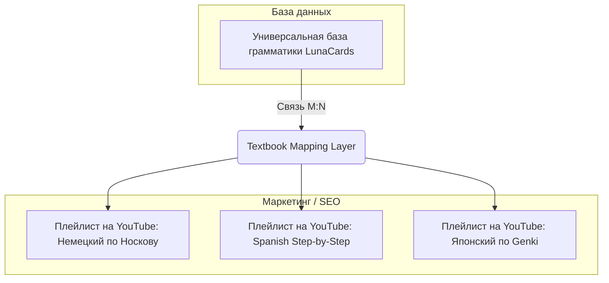
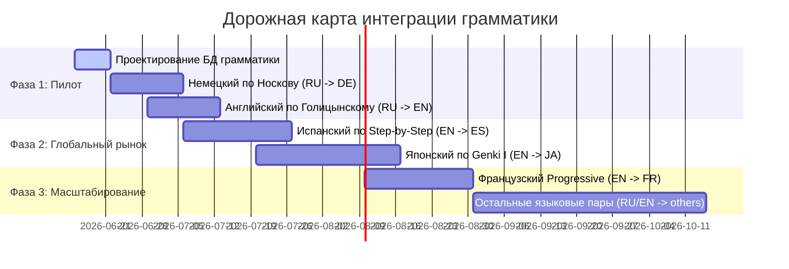

# Дорожная карта: Интеграция грамматических курсов и учебников в LunaCards

Этот документ фиксирует стратегический план, техническую архитектуру и правила юридической безопасности для запуска грамматических уроков/колод LunaCards. План основан на гибридном подходе: **универсальная база данных грамматических правил + маркетинговые "обертки" под популярные учебники для привлечения SEO-трафика**.

Статус: **Source of Truth**.

---

## 1. Концепция гибридной интеграции (The Hybrid Model)

Чтобы избежать дублирования контента и при этом собирать трафик по конкретным учебникам, мы разделяем структуру данных и её подачу:



### Принцип работы:
1. **Грамматическое ядро (Grammar Core DB):** Мы создаем атомарные грамматические карточки (например: *«Порядок слов в немецком придаточном предложении»*, *«Глагол gustar в испанском»*, *«Конструкция ...は...です в японском»*).
2. **Слой маппинга (Mapping Table):** В базе данных создается таблица соответствий. Каждая тема популярного учебника ссылается на набор наших универсальных атомарных карточек.
3. **Генерация выдачи:**
   * **Для сайта/приложения:** Пользователь видит стройный курс по уровням (CEFR A1 -> A2 -> B1).
   * **Для YouTube / Google Sheets:** Мы экспортируем плейлисты и колоды с заголовками учебников (например, *"LunaCards немецкий — Урок 12 по учебнику Носкова"*).

---

## 2. Матрица приоритетных учебников по языковым парам

Ниже представлены самые популярные и рекомендуемые (на Reddit, профильных форумах и в академической среде) учебники, с которых следует начать разработку.

### А. Для русскоязычных пользователей (Родной язык: RU)

| Изучаемый язык (Target) | Популярный учебник / База | Почему именно он? | Сложность оцифровки / Особенности |
| :--- | :--- | :--- | :--- |
| **Немецкий (DE)** | **С. А. Носков** *(«Новый самоучитель немецкого языка»)* | **Золотой стандарт самоучителей в РФ.** Отлично структурирован, понятен русскоязычному менталитету. | Средняя. Требует адаптации старых упражнений под интерактивные карточки. |
| **Английский (EN)** | **Ю. Б. Голицынский** *(«Грамматика. Сборник упражнений»)* | **Абсолютный хит на постсоветском пространстве.** Каждая школа и репетитор используют его для наработки грамматической базы. | Легкая. Темы четко разделены, огромная база предложений для отработки. |
| **Испанский (ES)** | **Георгий Нуждин** *(«Español en vivo»)* | Самый популярный российский учебник для вузов и курсов. Сочетает живой язык и жесткую структуру грамматики. | Высокая. Учебник содержит много длинных текстов, которые нужно делить на короткие карточки. |
| **Французский (FR)** | **И. Н. Попова, Ж. А. Казакова** | **Культовый академический учебник.** Дает фундаментальную базу грамматики и фонетики. | Высокая. Очень плотная и академичная подача, требует сильного упрощения для формата карточек. |
| **Китайский (ZH)** | **А. М. Кондрашевский** *(«Практический курс...»)* | Главный учебник во всех востоковедческих вузах России. | Высокая. Привязан к старой лексике, но грамматика объяснена фундаментально. |

### Б. Для англоязычных пользователей (Родной язык: EN) — Глобальный рынок

| Изучаемый язык (Target) | Популярный учебник / База | Статус в сообществе (Reddit) | Особенности |
| :--- | :--- | :--- | :--- |
| **Испанский (ES)** | **Barbara Bregstein** *(«Complete Spanish Step-by-Step»)* | **Топ-1 рекомендация на r/Spanish.** Четкая, последовательная структура от нуля до продвинутого. | Идеально ложится на структуру уровней A1-B2. |
| **Японский (JA)** | **Genki I & II** *(Banno et al.)* | **Главный мировой стандарт для начинающих.** Рекомендуется в 90% случаев на r/LearnJapanese. | Очень легко маппить, но требует интеграции с каной/кандзи. |
| **Немецкий (DE)** | **Anne Buscha, Szilvia Szita** *(«A-Grammatik» / «B-Grammatik»)* | Немецкие пособия Schubert-Verlag. Ценятся за чисто грамматическую направленность и обилие упражнений. | Отличный источник упражнений на раскрытие скобок и выбор вариантов. |
| **Французский (FR)** | **«Grammaire Progressive du Français»** *(CLE International)* | **"Библия" французской грамматики.** Используется по всему миру как эталон практических упражнений. | Логика деления на юниты идеально подходит для микро-колод. |
| **Китайский (ZH)** | **Integrated Chinese** *(Cheng & Tsui)* | Самый популярный учебник в американских университетах. | Требует строгой привязки грамматических конструкций к иероглифике. |

---

## 3. Техническая архитектура базы данных (Предложение)

Для реализации этой схемы в Postgres не нужно дублировать карточки. Достаточно связать таблицы через таблицы отношений:

```
[grammar_cards] (Universal Cards)
  - id (UUID)
  - target_language_id (int)
  - concept_name (text) — например: "conjugation_present_ar_verbs"
  - base_prompt (text)
  - target_answer (text)
  
[textbooks] (Catalogs of Textbooks)
  - id (int)
  - title (text) — например: "Complete Spanish Step-by-Step"
  - target_language_id (int)
  - support_language_id (int)

[textbook_units] (Chapters/Lessons)
  - id (int)
  - textbook_id (int)
  - unit_number (text) — например: "Chapter 1"
  - unit_title (text) — например: "Present Tense of Regular Verbs"
  - sort_order (int)

[textbook_card_mappings] (Link Table M:N)
  - textbook_unit_id (int)
  - grammar_card_id (UUID)
  - sort_order (int)
```

> [!TIP]
> **Преимущество:** Если мы находим ошибку в карточке глагола *hablar*, мы исправляем её один раз в таблице `grammar_cards`. Изменения автоматически применятся и в универсальном курсе испанского, и в курсе "по Bregstein", и в курсе "по Español en vivo".

---

## 4. Пошаговая дорожная карта реализации (Phased Roadmap)



### **Фаза 1: Пилотный запуск и инфраструктура (RU-рынок)**
1. **Проектирование базы данных:** Добавление таблиц маппинга грамматики и связей с учебниками.
2. **Пилот №1: Немецкий язык по Носкову (RU -> DE)**.
   * Оцифровка первых 10-15 глав учебника Носкова.
   * Генерация тестового видеоурока на YouTube-канал *"LunaCards — Учим немецкий"* с заголовком: *«Немецкий язык по Носкову: Урок 1 (Артикли и местоимения)»*.
3. **Пилот №2: Английский язык по Голицынскому (RU -> EN)**.
   * Оцифровка разделов *«Артикль»* и *«Существительное»* из Голицынского (они идут первыми).
   * Выпуск соответствующих видео и колод.

### **Фаза 2: Глобальный англоязычный рынок (EN-рынок)**
1. **Испанский язык (EN -> ES):** Оцифровка по структуре *"Complete Spanish Step-by-Step"* (Bregstein).
2. **Японский язык (EN -> JA):** Оцифровка по структуре *"Genki I"*. Это даст колоссальный приток аудитории из Reddit (r/LearnJapanese), так как там постоянно ищут качественные готовые деки Anki/LunaCards по Genki.

### **Фаза 3: Масштабирование и автоматизация**
1. **Французский язык (EN -> FR):** Оцифровка по структуре *"Grammaire Progressive du Français"*.
2. **Автоматический сборщик плейлистов:** Разработка скрипта, который на основе таблицы `textbook_card_mappings` автоматически собирает видео-уроки (склеивает слайды и аудио через FFmpeg) для YouTube под каждый конкретный учебник.

---

## 5. Правила именования и юридическая безопасность (Textbook Copyright Policy)

Для предотвращения автоматических блокировок на платформах дистрибуции (YouTube, Google Sheets, App Store/Google Play) из-за упоминания известных брендов учебников приняты следующие обязательные правила:

### А. Авторское право на контент (Content Rules)
* **100% уникальность предложений-примеров:** Все предложения, используемые в карточках, генерируются независимо или запрашиваются у LLM с жестким условием уникальности. Запрещено копировать предложения напрямую из оригинальных учебников или упражнений к ним.
* **Перефразирование теории:** Все грамматические пояснения, правила и подсказки должны быть пересказаны своими словами.

### Б. Политика использования брендов в названиях (Brand Naming Rules)
Чтобы исключить обвинения в несанкционированном использовании чужого бренда (попытке выдать себя за официальный продукт), заголовки видео, плейлистов и колод должны строиться по формуле:

$$\text{[Тема грамматики]} + \text{"для / в соответствии с"} + \text{[Название учебника + Юнит/Глава]}$$

* **Запрещенные форматы:**
  * *«Официальный курс по учебнику Genki»*
  * *«Немецкий язык: Носков, Урок 12»*
  * *«Raymond Murphy — Unit 5. Учим английский»*
* **Разрешенные форматы:**
  * *«Тренажер к учебнику Genki (Lesson 1) / Грамматика は и です»*
  * *«Практика немецкого языка (соответствует темам учебника Носкова, Урок 12)»*
  * *«Английская грамматика: Present Continuous (в стиле Murphy, Unit 5)»*

### В. Обязательный дисклеймер (Required Disclaimer)
В описании каждого видео на YouTube, в метаданных колод и в сопровождающих Google Sheets в обязательном порядке добавляется стандартная сноска:

> **RU:** *«LunaCards является независимым образовательным тренажером. Данные материалы разработаны независимо от авторов и издателей оригинального учебника [Название учебника] и не аффилированы с ними».*
>
> **EN:** *«LunaCards is an independent educational tool. These practice materials are developed independently and are not affiliated with, sponsored by, or endorsed by the authors or publishers of [Textbook Name].»*
